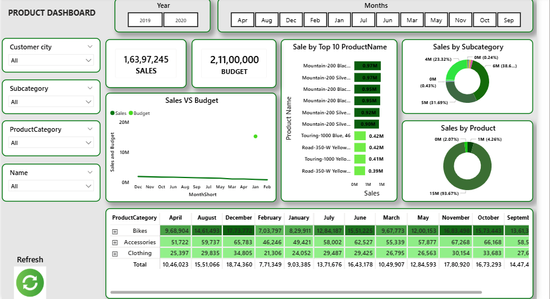

# Sales Dashboard – Power BI (AdventureWorks)
An interactive multi-page Power BI dashboard analyzing sales, customer, and product performance using the AdventureWorks dataset (2019–2020).

##📊 Dashboard Preview
##Sales Overview

##Customer Insights

##Product Analysis

Key Metrics

Total Sales: 1,63,97,245
Total Budget: 2,11,00,000
Time Period: 2019 – 2020 (month-wise filtering)

Dashboard Pages

1. Sales Dashboard

Sales vs Budget trend by month
Sales by Customer City (map visual)
Top 10 Products and Top 10 Customers by sales
Sales breakdown by Product Category and Gender

2. Customer Dashboard

Customer-wise monthly sales matrix
Sales vs Budget comparison
Top 10 customers by sales
City-wise customer sales distribution (map)

3. Product Dashboard

Product category and subcategory-wise sales (donut charts)
Top 10 products by sales
Category-wise monthly sales breakdown (matrix with drill-down: Bikes, Accessories, Clothing)

Features

Interactive slicers: Customer City, Subcategory, Product Category, Name, Year, Month
Drill-down matrix tables for category-level analysis
Map visuals for geographic sales distribution
Cross-filtering across all three dashboard pages

Tools Used

Power BI (Data Modeling, DAX, Power Query)
SQL (data extraction and transformation)
Excel (budget data integration)

Insights

Bikes category contributes the majority share of total sales
Mountain-200 series are the top-performing products
Sales are concentrated among a core group of top 10 customers

File Structure

Sales_Dashboard.pbix - Power BI dashboard file
1_png.png - Sales dashboard preview
2_png.png - Product dashboard preview
3_png.png - Customer dashboard preview

Author

Nandani | Aspiring Data Analyst
LinkedIn | GitHub
